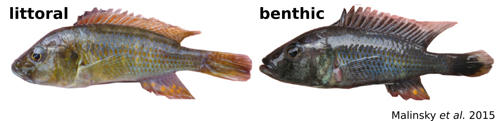
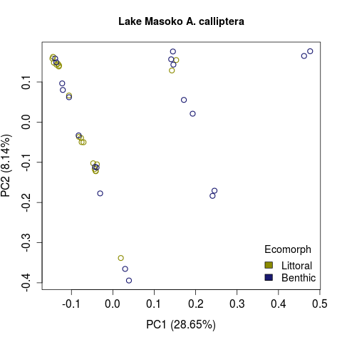
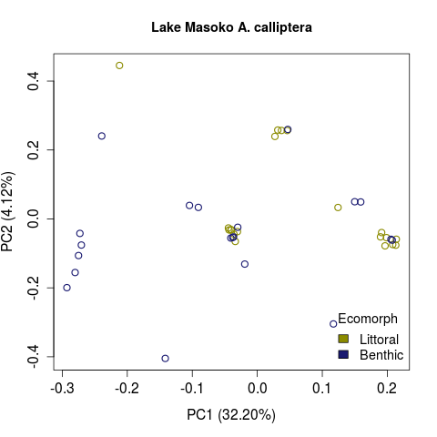
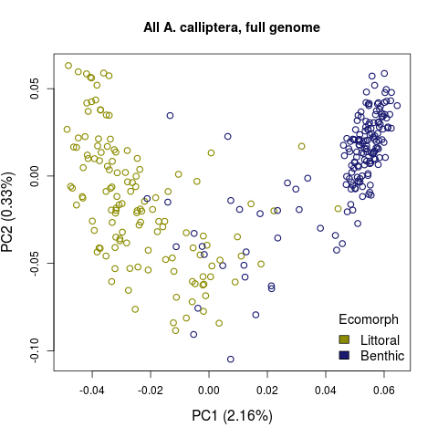
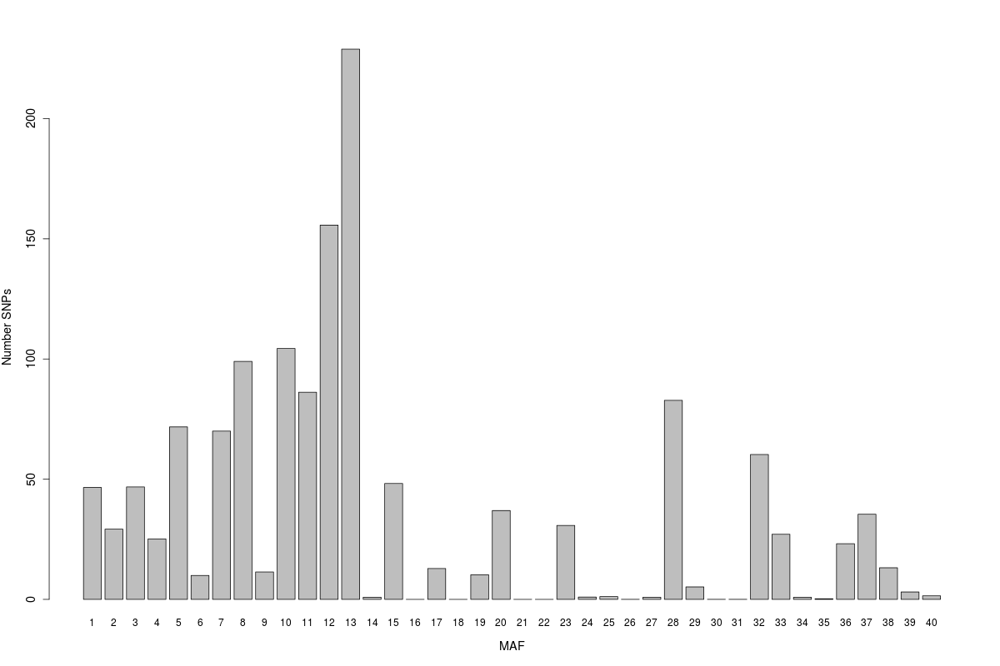
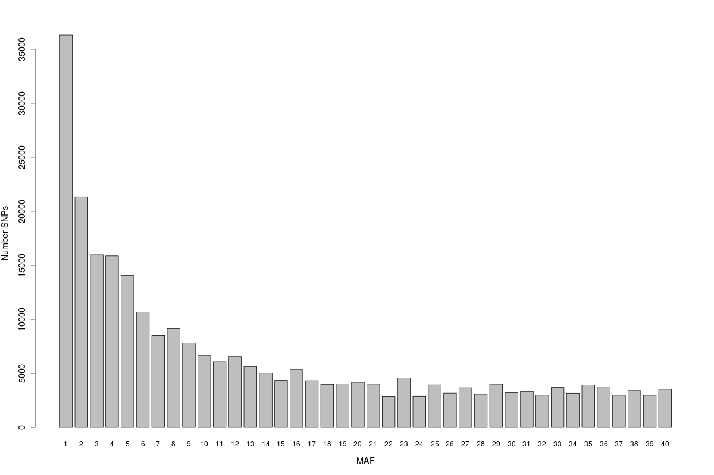
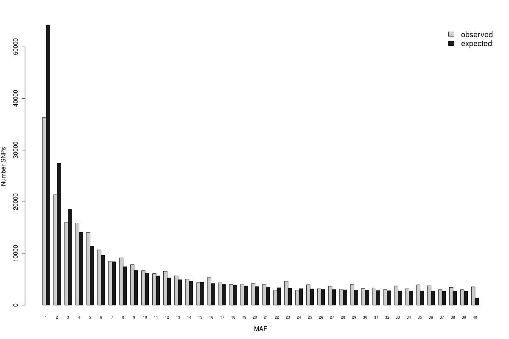
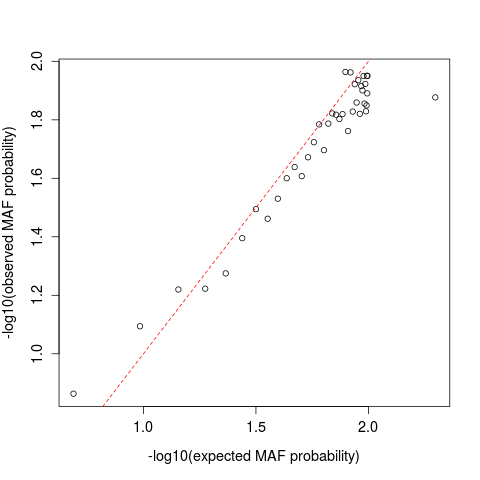

Estimation of allele frequencies, SNP calling, and genotype calling from NGS data
=================================================================================

For these excercises you will use whole genome sequencing data from 40 individuals of *Astatotilapia calliptera* from the crater 
Lake Masoko in Tanzania. Twenty of these samples represent a "littoral" ecomorph and the other 20 a 
"benthic" ecomorph. These individuals have been sequenced to a median coverage of 5.7x. See `/ricco/data/tyler/calmas_meta_sub.txt` for 
metadata on these samples.
<br>




The goals of this exercise are to<br>
* Calculate genotype likelihoods and posterior probabilities
* Call genotypes
* Estimate allele frequencies and calculate allele frequency posterior probabilities
* Call SNPs
* Estimate the site frequency spectrum
* Perform a Principle Component Analysis based on genotype posterior probabilities
* Perform a Dxy analysis of ecomorph differentiation

Make directories and set environmental variables for this session

```bash
# set up directories

mkdir ~/ngs_analysis
mkdir ~/ngs_analysis/output

# set environment variables

DIR=~/ngs_analysis
DATDIR=/ricco/data/tyler
BAMLIST=$DATDIR/cichlid_bams.list
CICHREF=$DATDIR/ref/GCA_900246225.3_fAstCal1.2_genomic_chromnames_mt.fa
BAMDIR=$DATDIR/bams
SCRIPTS=$DATDIR/scripts
ANGSD=/ricco/data/tyler/prog/bin/angsd
```
If you did not yet complete the Introduction to NGS Data excercises you'll need to copy over the quality controlled list of sites,
which I've provided a copy of (skip the following step if you completed the bcftools filtering):

```bash
# ONLY IF you don't aleady have the directory ~/ngs_intro/output then make it
# mkdir ~/ngs_intro/output

cp /ricco/data/tyler/output/qc_sites.pos ~/ngs_intro/output/

# index the sites file
 $ANGSD sites index ~/ngs_intro/output/qc_sites.pos
```

We will perform most analyses with the program [ANGSD](http://www.popgen.dk/angsd/index.php/ANGSD) which is also accurate for low - medium coverage NGS data.

ANGSD overview

	$ANGSD --help

Many of the calculations that you do with ANGSD are based on genotype likelihoods (GL)s,
which will improve accuracy over hard-called genotypes (avoids snowballing errors).
<br>
Let's calculate genotype likelihoods for the cichlids at the same 50 kb region that you filtered yesterday.
We'll also apply some quality control filters when calculating GLs from the bam files. You can see a full list of 
options by running

	$ANGSD -bam

<details>

<summary> click here for bam parsing options </summary>

```bash
$ $ANGSD -bam
	-> angsd version: 0.935-48-gff0c042 (htslib: 1.13-3-gd16bed5) build(Jul 23 2021 22:06:16)
	-> /ricco/data/tyler/prog/bin/angsd -bam 
	-> Analysis helpbox/synopsis information:
	-> Fri Jul 23 22:25:05 2021
---------------
parseArgs_bambi.cpp: bam reader:
	-bam/-b		(null)	(list of BAM/CRAM files)
	-i		(null)	(Single BAM/CRAM file)
	-r		(null)	Supply a single region in commandline (see examples below)
	-rf		(null)	Supply multiple regions in a file (see examples below)
	-remove_bads	1	Discard 'bad' reads, (flag & 512) 
	-uniqueOnly	0	Discards reads that doesn't map uniquely
	-show		0	Mimic 'samtools mpileup' also supply -ref fasta for printing reference column
	-minMapQ	0	Discard reads with mapping quality below
	-minQ		13	Discard bases with base quality below
	-trim		0	Number of based to discard at both ends of the reads
	-trim		0	Number of based to discard at 5' ends of the reads
	-trim		0	Number of based to discard at 3' ends of the reads
	-only_proper_pairs 1	Only use reads where the mate could be mapped
	-C		0	adjust mapQ for excessive mismatches (as SAMtools), supply -ref
	-baq		0	adjust qscores around indels (1=normal baq 2= extended(as SAMtools)), supply -ref
	-redo-baq		0 (recompute baq, instead of using BQ tag)
	-setQscore	-1	Set qscore to this value, relevant for missing qscores
	-checkBamHeaders 1	Exit if difference in BAM headers
	-doCheck	1	Keep going even if datafile is not suffixed with .bam/.cram
	-downSample	0.000	Downsample to the fraction of original data
	-nReads		50	Number of reads to pop from each BAM/CRAMs
	-minChunkSize	250	Minimum size of chunk sent to analyses
	--ignore-RG	1	(dev only)
	+RG		(null)	Readgroups to include in analysis(can be filename)
	+LB		(null)	Libraries to include in analysis(can be filename)

Examples for region specification:
		chr:		Use entire chromosome: chr
		chr:start-	Use region from start to end of chr
		chr:-stop	Use region from beginning of chromosome: chr to stop
		chr:start-stop	Use region from start to stop from chromosome: chr
		chr:site	Use single site on chromosome: chr
```
</details>

## Genotype likelihoods

Now lets calculate genotype likelihoods. ANGSD provides the option to run analyses over a region
(see `$ANGSD -bam` for region specifications) and/or a subset of sites with `-sites`. So, let's say we want to
only calculate genotype likelihoods for the quality-controlled sites in the region spanning sites 1 to 600,000 of chromosome 7.
Note that some options are on by default (e.g. `-remove_bads`), but we'll specify them to be explicit. We'll also specify some
commonly used filters that are redundant with the QC we performed yesterday to make the `-sites` file in order to demonstrate
how to carry out these filters within ANGSD. Note: *A sites file is not required to run ANGSD*. 
Note also that `-setMinDepth` and `-setMaxDepth` require reads to be counted, i.e. `-doCounts 1`. You should look 
through each of the arguments used and make sure that you understand them. Information for ANGSD filters is [here](http://www.popgen.dk/angsd/index.php/Filters).
<br>
We'll calculate GLs using the SAMtools likelihood model `-GL 1` (see `$ANGSD -GL`) and output them as a text file
that we can easily examine. This will take ~2.5 minutes.

```bash
$ANGSD -b $BAMLIST -ref $CICHREF -r chr7:1-600000 -sites ~/ngs_intro/output/qc_sites.pos \
-remove_bads 1 -uniqueOnly 1 -only_proper_pairs 1 -minQ 20 -minMapQ 20 -baq 1 -C 50 \
-setMinDepth 40 -setMaxDepth 700 -doCounts 1 -GL 1 -doGlf 4 -out $DIR/output/calmas_region
```

The base alignment quality (BAQ) adjustment will recalibrate the base quality scores around INDELS. The `-C` option
adjusts mapping quality for reads with excessive mismatches. The [samtools](http://www.htslib.org/doc/samtools-mpileup.html)
documentation recommends setting this to 50 for reads mapped with BWA. `-baq` and `-C` require that you supply the reference genome with `-ref`
<br>
Another useful option can be `-minInd X` in conjunction with `-minIndDepth Y`, which will require at least **X** individuals to be
covered by at least **Y** (default 1) reads to keep a site. We already applied this type of filter yesterday in a bit more detailed way:
We required at least 5 individuals from *each* ecomorph to be covered by at least 2 reads in order for the site to pass QC. Note that in
ANGSD version 0.935-48-gff0c042 `-minIndDepth` is not recognized, but `-minInd` can still be used (the default required individual depth of
1 will be used).

Looking at the standard output, what percentage of the sites provided to ANGSD were actually retained?

<details>

<summary> click here for help </summary>

```bash
-> Total number of sites analyzed: 593192
-> Number of sites retained after filtering: 538150
```
So ~90% of the sites were kept.

</details>

ANGSD always dumps a log file with information on how it was run. Check it out:

	less $DIR/output/calmas_region.arg

Have a look at the GLs. The first two columns refer to the reference sequence (chromososome and position). Then you have 10 likelihoods
for all possible genotypes in the order AA,AC,AG,AT,CC,CG,CT,GG,GT,TT. This set of 10 likelihoods is repeated sequentially starting from
the left of the file for each individual in the row order of individuals in the BAM file. The values are log-scaled likelihood ratios, 
scaled by the most likely genotype.

	less -S $DIR/output/calmas_region.glf.gz

We are analyzing 40 individuals, so we should have 402 fields in the glf file. You should confirm this and try to print the likelihoods
for the individual called CMASS6608007 at position chr7:1005 (each bam file is named by the individual, i.e. <idividual ID>.bam). What is 
their most likely genotype? If you need help you can click below.

<details>

<summary> click for help extracting GL info </summary>

```bash
# Count number of columns and subtract 2 (chromosome and position fields) to get the number of likelihood values

echo "$(($(zcat $DIR/output/calmas_region.glf.gz | head -n1 | wc -w)-2))"

# You should see that indeed there are 400 likelihood values.
# figure out what line CMASS6608007 is in the bam list.

INDNUM=$(grep -n "CMASS6608007.bam" $BAMLIST | cut -f1 -d':')
echo "$INDNUM"

# So this individual is at row 25 in the bam list. Now we can extract their likelihoods.

zcat $DIR/output/calmas_region.glf.gz | grep -m 1 $'^chr7\t10005\t' | cut -f 3- | perl -se '$start=($n-1)*10; @arr = split(/\t/,<>); print "@arr[$start .. $start+9]\n"' -- -n=$INDNUM
```
Since the likelihoods have been scaled to the most likely and log-transformed, the most likely genotype will
have a value of 0. For CMASS6608007 the 8th likelihood is zero, corresponding to the genotype 'GG'.

You could confirm this by looking at this site in the bcf file that you generated yesterday.

```bash
bcftools view -H -s CMASS6608007 -r chr7:10005 ~/ngs_intro/output/calmas_allsites.bcf.gz
```

Yep, it looks like this site is monomorphic with the reference a 'G' and this individual has data (your output should look like):

	chr7	10005	.	G	.	5018.12	.	DP=173;AD=173;SCR=21;MQSBZ=0.472176;FS=0;MQ0F=0;AN=2;DP4=96,77,0,0;MQ=57;NS=39	GT:DP:AD:SCR:QS	0/0:2:2:0:64

</details>

## Allele frequency estimation

Now will estimate allele frequencies using the GLs we just calculated as input. Note that you can use the bams as input again,
but you'd have to recalculate the likelihoods (with `-GL` as before), which is redundant. If we do supply GLs as input we also
need to provide the number of individuals in the GL file, `-nInd`, and the reference index file, `-fai`.

We can get some information about how to estimate allele frequencies with `$ANGSD -doMaf`.

	-doMaf	0 (Calculate persite frequencies '.mafs.gz')
		1: Frequency (fixed major and minor)
		2: Frequency (fixed major unknown minor)
		4: Frequency from genotype probabilities
		8: AlleleCounts based method (known major minor)
		NB. Filedumping is supressed if value is negative

It's also useful to know how ANGSD can identify major and minor alleles, `$ANGSD -doMajorMinor`

	-doMajorMinor	0
	1: Infer major and minor from GL
	2: Infer major and minor from allele counts
	3: use major and minor from a file (requires -sites file.txt)
	4: Use reference allele as major (requires -ref)
	5: Use ancestral allele as major (requires -anc)
	6: Use EBD for major and minor (requires read data)
	7: Use EBD for minor (Major is ref) (requires -ref and read data, (similar to SAMtools))
	-rmTrans: remove transitions 0
	-skipTriallelic	0


We'll use `-doMajorMinor 1` to have ANGSD figure out what the major and minor alleles are from the GLs and then, based on these 
identified, alleles calculate their allele frequencies with `-doMaf 1`. If we wanted to account for more uncertainty in the 
identificaton of what the minor allele is we could use `-doMaf 2`. This latter approach would take a bit longer since there would
be three minor alleles to consider instead of just one. We'll also skip any sites that appear to have more than 2 alleles with
`-skipTriallelic 1` (though we should have filtered these out already with our qc_sites.pos file).

```bash
$ANGSD -glf10_text $DIR/output/calmas_region.glf.gz -nInd 40 -fai $CICHREF.fai \
-doMajorMinor 1 -doMaf 1 -skipTriallelic 1 -out $DIR/output/calmas_region_af
```

Check out the output: `less $DIR/output/calmas_region_af.mafs.gz` The columns are<br>
(1) chromosome<br>
(2) position<br>
(3) major allele<br>
(4) minor allele<br>
(5) maximum likelihood estimate of the minor allele frequency<br>
(6) the number of individuals with data<br>

Here's the first 5 sites:

	chromo	position	major	minor	knownEM	nInd
	chr7	115	A	C	0.000002	33
	chr7	116	A	C	0.000002	33
	chr7	117	A	C	0.000002	33
	chr7	118	A	C	0.000003	34
	chr7	119	G	A	0.000001	35

## Dxy

Now that you know how to extract allele frequencies, one interesting thing we could do is estimate the absolute divergence 
between the two ecomorphs of *Astatotilapia calliptera* in your data. Specifcally, we can use the allele frequencies
in the respective ecomorphs to calculate Dxy, which is the average number of pairwise nucleotide differences between them.
It's important for this calculation that for each site we estimate the allele frequency for the *same* allele in both ecomorphs.
In order to do this we can set which allele is the major allele using `-doMajorMinor 4`, which will assume that the reference allele
is major (which may not be true, but that's okay because we are just wanting to differentiate between alleles). Then for a biallelic 
site, the "minor" (or other) allele will be the same in both ecomorphs. Note that the minor allele is inferred from the GLs. We need 
to do this because the *actual* major, i.e. the most frequent allele, in the ecomorphs could be different. So, let's get started...
<br><br>
We need a maf file for each ecomorph, so let's start by generating this for the littoral morphs. We could simply split the glf file
containing all individuals into a file with only littoral GLs and another with only benthic GLs. Alternatively, we can calculate
the allele frequencies using two different bam lists as input, which is what we'll do here. The bam list for littoral individuals is
/ricco/data/tyler/littoral_bams.list and the bam list for benthics is /ricco/data/tyler/benthic_bams.list.

```bash
# estimate littoral morph allele frequencies (-ref is required for -doMajorMinor 4)

$ANGSD -b $DATDIR/littoral_bams.list -ref $CICHREF -r chr7:1-600000 -sites ~/ngs_intro/output/qc_sites.pos \
-remove_bads 1 -uniqueOnly 1 -only_proper_pairs 1 -minQ 20 -minMapQ 20 -baq 1 -C 50 -skipTriallelic 1 \
-GL 1 -doMajorMinor 4 -doMaf 1 -out $DIR/output/calmas_region_af_littoral

# estimate benthic morph allele frequencies

$ANGSD -b $DATDIR/benthic_bams.list -ref $CICHREF -r chr7:1-600000 -sites ~/ngs_intro/output/qc_sites.pos \
-remove_bads 1 -uniqueOnly 1 -only_proper_pairs 1 -minQ 20 -minMapQ 20 -baq 1 -C 50 -skipTriallelic 1 \
-GL 1 -doMajorMinor 4 -doMaf 1 -out $DIR/output/calmas_region_af_benthic
```
Take a look at these new maf files, you'll notice that there is an additional column specifying the reference allele since we included 
`-ref` in these runs. The major allele should match the ref allele since we used `doMajorMinor 4`.
<br>
Now we'll use these maf files as input to a program, dxyWindow, in order to calculate Dxy in XX kb windows. dxyWindow belongs to a 
suite of tools (https://github.com/tplinderoth/PopGenomicsTools) that can be used to perform various population genetic analyses.
You can enter `$DATDIR/prog/bin/dxyWindow` to see some help for the program:

	dxyWindow [options] <pop1 maf file> <pop2 maf file>
	
	Options:
	-winsize      INT     Window size in base pairs (0 for global calculation) [0]
	-stepsize     INT     Number of base pairs to progress window [0]
	-minind       INT     Minimum number of individuals in each population with data [1]
	-fixedsite    INT     (1) Use fixed number of sites from MAF input for each window (window sizes may vary) or (0) constant window size [0]
	-sizefile     FILE    Two-column TSV file with each row having (1) chromsome name (2) chromosome size in base pairs
	-skip_missing INT     Do not print windows with zero effective sites if INT=1 [0]
	
	Notes:
	* -winsize 1 -stepsize 1 calculates per site dxy
	* -sizefile is REQUIRED(!) with -fixedsite 0 (the default)
	* Both input MAF files need to have the same chromosomes in the same order
	* Assumes SNPs are biallelic across populations
	* For global Dxy calculations only columns 4, 5, and 6 below are printed
	* Input MAF files can contain all sites (including monomorphic sites) or just variable sites
	* -fixedsite 1 -winsize 500 would for example ensure that all windows contain 500 SNPs
	
	Output:
	(1) chromosome
	(2) Window start
	(3) Window end
	(4) dxy
	(5) number sites in MAF input that were analyzed
	(6) number of sites in MAF input that were skipped due to too few individuals

If you want to see what the `-sizefile` for the fAstCal1.2 reference genome looks like you can check it out: `cat $DATDIR/ref/fAstCal1.2_chr_lengths.txt`
Now, let's run dxyWindow.

```bash
$DATDIR/prog/bin/dxyWindow -winsize 10000 -stepsize 5000 -fixedsite 0 -sizefile $DATDIR/ref/fAstCal1.2_chr_lengths.txt -skip_missing 1 \
$DIR/output/calmas_region_af_littoral.mafs.gz $DIR/output/calmas_region_af_benthic.mafs.gz > $DIR/output/calmas_ecomorph_dxy.txt
``` 
The global Dxy printed to the screen states that there are on average ~758 nucleotide differences in 538,384 sites when comparing
littoral to benthic individuals. This means that there are approximately only 0.0014 pairwise differences on average per site, which 
is low and so indicates that these ecomorphs are likely quite genetically similar. This is only based on a small region and 
in practice you'd want to make this inference across the genome. Accordingly, looking at how Dxy is distributed across the genome, 
i.e. where the ecomorphs appear to be particularly divergent or similar could provide evidence for selection or introgression,
respectively.

You can see what Dxy looked like in 10 kb windows when sliding along our small example region in increments of 5 kb. Typically
it can be useful to visual these sliding window analyses as Manhattan plots.

	cat $DIR/output/calmas_ecomorph_dxy.txt

## Call SNPs

At this point you're probably all amped up to actually call SNPs right? You're in luck because that's exactly what we're going to do.
You can statistically test for whether a site is variable in ANGSD using a likelihood ratio (LR) test, which compares the likelihood that the 
minor allele frequency (MAF) is zero (the null) to the likelihood of the estimated MAF (`-doMaf`). Under the null, -2log(LR statistic) 
is distributed according to a chi-square(1 d.f.), and so we can calculate a p-value for whether the estimated MAF is statistically 
different from zero, in which case the site is a SNP.
<br>
You can call SNPs based on a particular p-value cutoff using `SNP_pval`, so that's what we'll do for the first 1 MB on chromosome 7

```bash
$ANGSD -glf10_text $DIR/output/calmas_region.glf.gz -nInd 40 -fai $CICHREF.fai \
-doMajorMinor 1 -doMaf 1 -SNP_pval 1e-6 -skipTriallelic 1 -out $DIR/output/calmas_region_snpcall
```
Look at the file `less $DIR/output/calmas_region_snpcall.mafs.gz`, which contains only sites called as variable.

The columns of this maf file are the same as before, except now there is an additional column 'pK-EM', which is the p-value corresponding
to the likelihood ratio test of whether a given site is variable. One useful option to be aware of when calling SNPs (or working with data 
involving variable sites in general) is `-minMaf X` (which requires `-doMaf` when used), which filters out any sites with a MAF <**X** from
the analyses. 

Compare the number of called SNPs and distribution of allele frequencies to the case when you use a less stringent p-value cutoff
for whether a site is variable. This time we'll use a SNP p-value cutoff of 0.01.

```bash
$ANGSD -glf10_text $DIR/output/calmas_region.glf.gz -nInd 40 -fai $CICHREF.fai \
-doMajorMinor 1 -doMaf 1 -SNP_pval 0.01 -skipTriallelic 1 -out $DIR/output/calmas_region_snpcall_liberal
```

Count the number of SNPs in the two maf files of SNPs

``` bash
# p-value cutoff of 1e-6

echo "$(($(zcat $DIR/output/calmas_region_snpcall.mafs.gz | wc -l)-1))"

# p-value cutoff of 1e-2

echo "$(($(zcat $DIR/output/calmas_region_snpcall_liberal.mafs.gz | wc -l)-1))"
```
Plot the MAF distribution

```bash
$DATDIR/scripts/plotAFDist.R $DIR/output/calmas_region_snpcall.mafs.gz $DIR/output/calmas_region_snpcall_liberal.mafs.gz $DIR/output/snp_call_comparison

# Ignore the warnings about closing the unsed connections.

# View the plot

evince $DIR/output/snp_call_comparison.pdf
```
<details>

<summary> Click for plotAFDist.R code </summary>

```bash
#!/usr/bin/env Rscript

# plotAFDist.R <mafs.gz file 1> <mafz.gz file 2> <output prefix>

library(ggplot2)

# parse arguments
args <- commandArgs(trailingOnly=TRUE)

maf1 = read.table(gzfile(args[1],'rt'), head=TRUE)
maf2 = read.table(gzfile(args[2],'rt'), head=TRUE)
outprefix = args[3]

# combine the data so that allele frequency densities can be plotted together
maf1$SNP_pval <- "1e-6"
maf2$SNP_pval <- "1e-2"
maf.comb <- rbind(maf1, maf2)
maf.comb$SNP_pval <- factor(maf.comb$SNP_pval, levels=c("1e-6","1e-2"), order=TRUE)

# plot
pdf(file=paste0(outprefix,".pdf"))
ggplot(maf.comb, aes(knownEM, fill = SNP_pval)) + geom_density(alpha = 0.4, bw=0.015) + theme_classic(base_size=16) + theme(axis.line = element_line(size=0.5)) + xlab("MAF") + ylab("Density")
invisible(dev.off())
```
</details>

You can click below to view what you should have seen

<details>

<summary> snp calling comparison </summary>

`-SNP_pval 1e-6`: 1260 SNPs
<br>
`-SNP_pval 1e-2`: 1709 SNPs


</details>

Describe the difference between the two SNP p-value cutoffs.

## Genotype posterior probabilities and calling

As you looked at the pileups of the low coverage data yesterday, it might have occured to you that if you had some idea of what
the allele frequencies were in the population, you would probably have at least a bit more confidence in what the genotype would be.
For example, if the pileup information for an individual was `6  C,,...  5G/BGB`, you'd think that it would help quite a bit in deciding
how real that 'C' alternate allele is (since it could very well be an error) if you knew that that allele existed in the population,
and even better if you knew it's frequency. If you knew the frequency of the allele in the population then you could use a population
genetic model, e.g. Hardy-Weinberg, to figure out the probability of sampling a heterozygote. This is essentially exactly what ANGSD
does to call genotypes.
<br>
You now know how to estimate genotype likelihoods from the sequencing data, and you also know how to estimate allele frequencies, which
gives you *prior* knowledge on the probability of sampling a particular allele. Now we have all of the components of Bayes' theorem
(i.e. genotype likelihoods, and the genotype probabilities given an estimate of the allele frequencies) to calculate genotype posterior
probabilities. By incorporating prior knowledge of allele frequencies we can increase the accuracy of genotype calling.
<br>
So now let's estimate some genotype posterior probilities. To invoke genotype calling you use `-doPost` and `-doGeno`.

	-doPost	0	(Calculate posterior prob 3xgprob)
		1: Using frequency as prior
		2: Using uniform prior
		3: Using SFS as prior (still in development)
		4: Using reference panel as prior (still in development), requires a site file with chr pos major minor af ac an

	-doGeno	0
		1: write major and minor
		2: write the called genotype encoded as -1,0,1,2, -1=not called
		4: write the called genotype directly: eg AA,AC etc 
		8: write the posterior probability of all possible genotypes
		16: write the posterior probability of called genotype
		32: write the posterior probabilities of the 3 gentypes as binary
		-> A combination of the above can be choosen by summing the values, EG write 0,1,2 types with majorminor as -doGeno 3
		-postCutoff=0.333333 (Only genotype to missing if below this threshold)
		-geno_minDepth=-1	(-1 indicates no cutof)
		-geno_maxDepth=-1	(-1 indicates no cutof)
		-geno_minMM=-1.000000	(minimum fraction af major-minor bases)
		-minInd=0	(only keep sites if you call genotypes from this number of individuals)

		NB When writing the posterior the -postCutoff is not used
		NB geno_minDepth requires -doCounts
		NB geno_maxDepth requires -doCounts

We'll calculate genotype posterior probabilities using a HWE prior, `-doPost 1` given the allele frequencies estimated with `-doMaf 1`
and then output the posterior probabilities for the major/major, major/minor, minor/minor genotypes for each individual with `doGeno 8`.
We'll limit our analysis to SNP position only (`SNP_pval 1e-6`). Note that while we need to estimate allele frequencies, we already 
have a file containing them, which we don't need to write again, so we can suppress writing another maf file by making the value to 
`-doMaf` negative. Note that this version of ANGSD is specifying that we *have* to specify `-GL`, so we'll perform the calling using the
BAMS as input. We'll use many of the same quality controls as last time.

```bash
$ANGSD -b $BAMLIST -ref $CICHREF -r chr7:1-600000 -sites ~/ngs_intro/output/qc_sites.pos \
-remove_bads 1 -uniqueOnly 1 -only_proper_pairs 1 -minQ 20 -minMapQ 20 -baq 1 -C 50 \
-GL 1 -doMajorMinor 1 -doMaf -1 -SNP_pval 1e-6 -skipTriallelic 1 -doPost 1 -doGeno 8 -out $DIR/output/calmas_region_genocall
```

The first two columns of the output are the chromosome and position. The following columns list the the posterior probabilites
for the major/major, major/minor, and minor/minor for each individual in the same order as they appeared from the top of the bam list.

Take a look at the ouput `less -S $DIR/output/calmas_region_genocall.geno.gz`

We are analyzing 40 individuals, so we should have 122 fields in the geno file. You should confirm this and try to print the genotype posterior
probabilities for the individual called CMASS6608007 at position chr7:136054. What is the most probable genotype call? You should also ensure 
that the probabilities sum to 1.

<details>

<summary> click for help extracting genotype posterior probability info </summary>

```bash
# Count number of columns and subtract 2 (chromosome and position fields) to get the number of posterior probability values

echo "$(($(zcat $DIR/output/calmas_region_genocall.geno.gz | head -n1 | wc -w)-2))"

# You should see that indeed there are 120 posterior probability values.
# figure out what line CMASS6608007 is in the bam list.

INDNUM=$(grep -n "CMASS6608007.bam" $BAMLIST | cut -f1 -d':')
echo "$INDNUM"

# So this individual is at row 25 in the bam list. Now we can extract their genotype posteriors.

zcat $DIR/output/calmas_region_genocall.geno.gz | grep -m 1 $'^chr7\t136054\t' | cut -f 3- | perl -se '$start=($n-1)*3; @arr = split(/\t/,<>); print "@arr[$start .. $start+2]\n"' -- -n=$INDNUM
```
The first genotype configuration has the maximum posterior probability (= 0.994656), so the most probably gentoype is Major/Major.

The genotypes do indeed sum to 1 (0.994656 + 0.005344 + 0 = 1).

</details>

What do you think genotype probabilities of `0.333333   0.333333   0.333333` mean for an individual?

We can also perform hard genotype calling using `-doGeno 2` or `-doGeno 4`, which we'll do now. Let's use `-doGeno 2` which represents 
called genotypes as the number of minor alleles: 0 = Major/Major, 1=Major/Minor, 2=Minor/Minor, -1 = missinge genotype. The genotype 
with the maximum posterior probability will be called. Perhaps, however, you also want information on the identify of the major and minor
allele. Printing argument values can be summed to combine outputs. `-doGeno 1` prints the major and minor alleles, so if we add this value
of 1 to `-doGeno 2`, we have `-doGeno 3`, which should give us the output we want.
<br>
It's often a good idea when hard-calling to specify a minimum posterior probability
for calling, which is achieved with the `-postCutoff` option. `-postCutoff X` which not call a genotype if the maximum posterior probability
is < **X**. We'll use a minimum posterior cutoff of 0.90.
<br>
So now let's hard-call genotypes.

```bash
$ANGSD -b $BAMLIST -ref $CICHREF -r chr7:1-600000 -sites ~/ngs_intro/output/qc_sites.pos \
-remove_bads 1 -uniqueOnly 1 -only_proper_pairs 1 -minQ 20 -minMapQ 20 -baq 1 -C 50 \
-GL 1 -doMajorMinor 1 -doMaf -1 -SNP_pval 1e-6 -skipTriallelic 1 -doPost 1 -doGeno 3 -postCutoff 0.90 -out $DIR/output/calmas_region_genocall_hard
```
The output now has columns (1) chromosome, (2) position, (3) major allele, (4) minor allele, (5..number_individuals) genotype calls for every
individual.

Take a look at the ouput `less -S $DIR/output/calmas_region_genocall_hard.geno.gz`

We are analyzing 40 individuals, so we should have 44 fields in the geno file. You should confirm this. What is the genotype call for 
CMASS6608007 at position chr7:136054?

<details>

<summary> click for help extracting hard-call info </summary>

```bash
# Count number of columns and subtract 4 (chromosome, position, major allele, minor allele fields) to get the number genotype calls.

echo "$(($(zcat $DIR/output/calmas_region_genocall_hard.geno.gz | head -n1 | wc -w)-4))"

# You should see that indeed there are 40 genotype calls.
# figure out what line CMASS6608007 is in the bam list.

INDNUM=$(grep -n "CMASS6608007.bam" $BAMLIST | cut -f1 -d':')
echo "$INDNUM"

# So this individual is at row 25 in the bam list. Now we can extract their genotype posteriors.

zcat $DIR/output/calmas_region_genocall_hard.geno.gz | grep -m 1 $'^chr7\t136054\t' | perl -se '@arr = split(/\t/,<>); print "$arr[$n+3]\n"' -- -n=$INDNUM
```
The called genotype is '0', meaning that this individuals is most probably 'CC'.

</details>

## PCA

Let's do some quick biological inference now that you know how to call genotypes. We'll use ANGSD to calculate genotype posterior probabilities and
output these to a binary file `-doGeno 32`, which we'll use an input to the progra ngsCovar in order to calculate a genetic covariance matrix 
for all of the Lake Masoko *A. calliptera* individuals. ngsCovar is part of the [ngsTools](https://github.com/mfumagalli/ngsTools) software toolbox, 
which is a set of programs for analyzing genetic data and particularly suited to working with ANGSD outputs. This covariance matrix will allow us to 
perfrom a Principle Component Analysis (PCA) using our genetic data. We are not hard-calling gentoypes and so can better avoid snow-balling error 
from incorrectly called genotypes. There are [other](http://www.popgen.dk/angsd/index.php/PCA) ways of performing PCA with ANGSD, so this is just a 
demonstration of one approach.
<br>
First, we calculate genotype posteriors in binary format.

```bash
$ANGSD -b $BAMLIST -ref $CICHREF -r chr7:1-600000 -sites ~/ngs_intro/output/qc_sites.pos \
-remove_bads 1 -uniqueOnly 1 -only_proper_pairs 1 -minQ 20 -minMapQ 20 -baq 1 -C 50 \
-GL 1 -doMajorMinor 1 -doMaf -1 -SNP_pval 1e-6 -skipTriallelic 1 -doPost 1 -doGeno 32 -out $DIR/output/calmas_region_genocall_binary
```
Second, we estimate a genetic covariance matrix among all individuals based on the genotype posterior probabilities with ngsCovar.

	$DATDIR/prog/bin/ngsCovar
	
	Input:
	-probfile: file with genotype posterior probabilities [required]
	-outfile: name of output file [required], currently it is a text file, tab separated with n*n cells
	-sfsfile: file with SFS posterior probabilities [required if you want to weight each site by its probability of being variable]
	-nind: nr of individuals [required]
	-nsites: nr of sites [required]
	-norm: if 0 no normalization, if 1 matrix is normalized by (p(1-p)) as in Patterson et al 2006, if 2 normalization is 2p(1-p) [0]
	-verbose: level of verbosity [0]
	-block_size: how many sites per block when reading the input file [0]
	-call: whether calling genotypes (1) or not (0) [0]
	-offset: starting position of subset analysis [1]
	-minmaf: filter out sites with estimated MAF less than minmaf or greater than 1-minmaf [0] (this filtering will be ignored when using the weighting approach
	-genoquality: text file with nsites lines; each line has a 0 and 1; if 0 the program will ignore this site [NULL]

You'll need to know the number of sites in your geno file. This can easily be counted from the mafs file if you outputted that. In this case 
we can just count the number of lines in the text version of the geno file that we generated previously. We also need to unzip the geno file
in order for ngsCovar to read it.

```bash
# Count sites in geno file
NGENOSITES=$(($(zcat $DIR/output/calmas_region_genocall.geno.gz | wc -l)-1))

# Unzip geno file
gunzip $DIR/output/calmas_region_genocall_binary.geno.gz

# Calculate covariance matrix
$DATDIR/prog/bin/ngsCovar -probfile $DIR/output/calmas_region_genocall_binary.geno -nind 40 -nsites $NGENOSITES -norm 0 -call 0 -outfile $DIR/output/calmas.covar

# You can check this 40 x 40 covariance matrix out if you want. The order of individuals
# in the matrix corresponds to their order in the geno file.
less -S $DIR/output/calmas.covar
```
Lastly, we'll perform eigen decomposition on this covariance matrix in R and plot the PCA.

```bash
$DATDIR/scripts/plotPCA.R $DIR/output/calmas.covar $DATDIR/calmas_meta_sub.txt $DIR/output/calmas_pca
```
Have a look at the PCA.

```bash
evince $DIR/output/calmas_pca.pdf
```
Now try estimating a new covariance matrix with only common variants, which we will call any SNPs with an allele frequency > 25%. On actual
data you probably wouldn't set a minumum MAF this high since it would remove a lot of data, rather around 5%, but we'll be extreme here 
for demonstration purposes.

```bash
$DATDIR/prog/bin/ngsCovar -minmaf 0.25 -probfile $DIR/output/calmas_region_genocall_binary.geno -nind 40 -nsites $NGENOSITES -norm 0 -call 0 -outfile $DIR/output/calmas_common.covar
```

Generate another PCA from this new covariance matrix

```bash
# Plot

$DATDIR/scripts/plotPCA.R $DIR/output/calmas_common.covar $DATDIR/calmas_meta_sub.txt $DIR/output/calmas_common_pca

# Examine the PCA

evince $DIR/output/calmas_common_pca.pdf
```

Click below to view the PCA plots you've just generated along with one run using all SNPs across the genome with MAF >5% (the last plot includes all  
individuals from the Masoko sex determination study with morph information).

<details>

<summary> click for PCA plots </summary>

40 individuals chr7:1-60000 all SNPs
<br>

<br><br>
40 individuals chr7:1-60000 SNPs > 25% MAF
<br>

<br><br>
300 individuals, full genome, SNPs > 5% MAF
<br>


</details>

What does PC1 appear to be describing in biological terms? How robust is this interpretation to differences in the amount of data used and how it is treated?

## Site frequency spectrum

We will now learn how to estimate the site frequency spectrum (SFS), which is a very useful summary of the distribution of 
allele frequencies in a population sample. The SFS can be informative about data quality, population demography, and selection.
When ancestral alleles are known, one can "polarize" SNPs in terms of which alleles are ancestral and derived. You can supply an 
ancestral FASTA sequence to ANGSD with the `-anc` argument, which it will use to polarize SNPs. This allows for calculating the 
unfolded SFS, which considers allele frequency classes ranging from 1/2N to (2N-1)/2N, where N is the diploid sample size. In many 
cases the ancestral allele may not be known, in which case we are limited to classifying alleles as major (more frequent) or 
minor (rarer), and calculate the "folded" SFS. The folded SFS considers only allele frequency classes of 1/2N to 1/2. In the folded 
case a site with an allele frequency of (2N-1)/2N is in an equivalent class as a 1/2N site, a (2N-2)/2N site is equivalent to a 2/2N 
site, a (2N-3)/2N site is equivalent to a 3/2N site, up to a class of 1/2 allele frequency (the highest frequency a minor allele can 
have by definition). The "folded" term spawns from these frequency equivalence classes since an unfolded SFS can be "folded" at the 
middle (50% allele frequency class) to get the folded SFS.

To calculate the SFS we first estimate the likelihood of every possible allele frequency for every site with `-doSaf 1`, which assumes 
a HWE relationship between genotype and allele frequencies. For other `-doSaf` models see `$ANGSD -doSaf` or [here](http://www.popgen.dk/angsd/index.php/SFS_Estimation).
. We do not know what the ancestral alleles are so will calculate the folded SFS by supplying the reference FASTA to `-anc` in place of an actual
ancetral state FASTA in conjunction with specifying `-fold 1`

```bash
$ANGSD -glf10_text $DIR/output/calmas_region.glf.gz -nInd 40 -fai $CICHREF.fai \
-doSaf 1 -anc $CICHREF -out $DIR/output/calmas_region_folded
```
This produces 3 files: a binary *.saf file which contains the log-scaled allele frequency likelihoods at all sites, it's associated *.saf.idx index file,
and a binary *.pos file containing which sites are contained in the .saf file. You can have a look at the allele frequency likelihoods using 
`realSFS`. The first two columns are chromosome, and position, followed by N+1 columns with the log likelihoods for allele frequencies 0, 1/2N, N.

```bash
$DATDIR/prog/bin/realSFS print $DIR/output/calmas_region_folded.saf.idx | less -S
```
<details>

<summary> click for extended information on realSFS functionality </summary>

	$DATDIR/prog/bin/realSFS

	-> ---./realSFS------
	-> EXAMPLES FOR ESTIMATING THE (MULTI) SFS:

	-> Estimate the SFS for entire genome??
	-> ./realSFS afile.saf.idx 

	-> 1) Estimate the SFS for entire chromosome 22 ??
	-> ./realSFS afile.saf.idx -r chr22 

	-> 2) Estimate the 2d-SFS for entire chromosome 22 ??
	-> ./realSFS afile1.saf.idx  afile2.saf.idx -r chr22 

	-> 3) Estimate the SFS for the first 500megabases (this will span multiple chromosomes) ??
	-> ./realSFS afile.saf.idx -nSites 500000000 

	-> 4) Estimate the SFS around a gene ??
	-> ./realSFS afile.saf.idx -r chr2:135000000-140000000 

	-> Other options [-P nthreads -tole tolerence_for_breaking_EM -maxIter max_nr_iterations -bootstrap number_of_replications -resample_chr 0/1]

	-> See realSFS print for possible print options
	-> Use realSFS print_header for printing the header
	-> Use realSFS cat for concatenating saf files

	->------------------
	-> NB: Output is now counts of sites instead of log probs!!
	-> NB: You can print data with ./realSFS print afile.saf.idx !!
	-> NB: Higher order SFS's can be estimated by simply supplying multiple .saf.idx files!!
	-> NB: Program uses accelerated EM, to use standard EM supply -m 0 
	-> Other subfunctions saf2theta, cat, check, dadi

</details>

Now find an estimate of the SFS which maximizes the probability of observing these per site allele frequency likelihoods.
Be sure to specify `-fold 1` again in order to estimate the folded SFS. A useful option with `realSFS` is the ability to 
specify specific regions in the usual ANGSD `-r` syntax. This enables you to investigate what the SFS looks like in a region 
that you suspect may have experienced a selective sweep for example. Here we'll omit any region specification in order to
estimate the global, "genome-wide" SFS.

```bash
$DATDIR/prog/bin/realSFS -fold 1 $DIR/output/calmas_region_folded.saf.idx > $DIR/output/calmas_region_folded.sfs
```
The output is a text file of the expected counts of sites in each minor allele frequency class 0, 1/2N, ..., N-1/N, N:

```bash
cat $DIR/output/calmas_region_folded.sfs
```
Let's visualize the SFS

```bash
$DATDIR/scripts/plotSFS.R $DIR/output/calmas_region_folded.sfs $DIR/output/calmas_region_folded
```
<details>

<summary> click here for plotSFS.R code </summary>

```bash
#!/usr/bin/env Rscript

# plotSFS.R <SFS file> <output prefix>

# parse inputs
args <- commandArgs(trailingOnly=TRUE)

sfs <- scan(args[1])
outprefix <- args[2]
n <- (length(sfs)-1)/2

sfs = sfs[2:(n+1)] # restrict to folded categories and remove fixed class

# plot
pdf(file=paste0(outprefix,".pdf"),width=14,height=7)
barplot(sfs, xlab="MAF", ylab="Number SNPs", names=1:n, cex.names=0.8, cex.axis=1.2, cex.lab=1.2)
invisible(dev.off())
```

</details>

Look at the SFS for our small example region.

```bash
evince $DIR/output/calmas_region_folded.pdf
```
<details>

<summary> click here in case you have trouble viewing the SFS </summary>



</details>

This SFS looks very strange because our example region is quite short and there is high sampling variance with few SNPs. 
The folded SFS for all of chromsome 7 (below) has been generated for you in the same way, except no quality controls were applied, but 
still it looks much more sane. Try to compare this observed SFS to the expected SFS from a neutrally evolving, constant-size
population. We expect that the number of SNPs for which x sampled chromosomes carry a mutation to be proporitional to 1/x. 
Try to think of how you can compare the observed to the expected SFS, and then you can click below for help.
<br>
Folded SFS for all of chromosome 7:


<details>

<summary> click for SFS comparison </summary>

```bash
# barplot
$DATDIR/scripts/compare_sfs.R $DATDIR/output/calmas_region_folded_chr7.sfs $DIR/output/chr7_folded_sfs 1 bar

# scatterplot
$DATDIR/scripts/compare_sfs.R $DATDIR/output/calmas_region_folded_chr7.sfs $DIR/output/chr7_folded_sfs 1 scatter
```
The following two plots provide essentially the same information and just show different ways of comparing the observed to the expected SFS.





Describe how and why you think the observed SFS differs from the expected SFS.

Code used to produce the SFS comparison plots:
```bash
#!/usr/bin/env Rscript

# compare_sfs.R <SFS file> <output prefix> <use folded (0|1)> <plot type: "bar"|"scatter">

# parse inputs
args <- commandArgs(trailingOnly=TRUE)

obs <- scan(args[1])
outprefix <- args[2]
fold <- as.numeric(args[3]) # is the SFS folded (1 = yes, 0 = no)
plottype <- args[4]

obs <- obs[-1] # remove fixed category
nchr = length(obs) # number chromosomes
n = nchr/2
if (fold) obs <- obs[1:n] # format observed SFS
s =  sum(obs) # number segregating sites
nlab = ifelse(fold,n,nchr)

# calculate expected unfolded SFS counts
a = sum(1/1:(nchr-1))
sfs.expected <- sapply(1:(nchr-1),function(x,segsites,a){segsites/(x*a)}, segsites=s, a=a)

# fold SFS if necessary
if (fold) {
        sfs.fold = sapply(1:(n-1),function(x,sfs,nchr){sfs[x]+sfs[nchr-x]},nchr=nchr,sfs=sfs.expected)
        sfs.fold = c(sfs.fold,sfs.expected[n])
        sfs.expected = sfs.fold
}


if (plottype == "bar") {
# plot observed vs expected as a barplot
        pdf(file=paste0(outprefix,"_barplot.pdf"),width=14,height=7)
        sfs.mat <- t(as.matrix(data.frame(obs=obs, expected=sfs.expected)))
        barplot(sfs.mat, beside=TRUE, names=c(1:n), cex.names=0.7, col=rep(c("grey80","grey10"),nlab),xlab="MAF",ylab="Number SNPs", cex.lab=1.2, cex.axis=1.2)
        legend('topright',c("observed","expected"),fill=c("grey80","grey10"),bty='n',cex=1.2)
        invisible(dev.off())
} else if (plottype == "scatter") {
        # plot expected vs observed scatterplot
        pdf(file=paste0(outprefix,"_scatter.pdf"))
        sfs.obs.p <- obs/sum(obs)
        sfs.e.p <- sfs.expected/sum(sfs.expected)
        plot(y=-log10(sfs.obs.p), x=-log10(sfs.e.p), ylab="-log10(observed MAF probability)", xlab="-log10(expected MAF probability)", cex.lab=1.2, cex.axis=1.2)
        abline(0,1,col="red",lty=2)
        invisible(dev.off())
} else stop("Unrecognized plot type")
```

</details>

Lastly, we can use the global SFS estimate as a prior on the probability of sampling a site belonging to a given allele frequency class.
The global SFS prior, along with the per site allele frequency likelihoods from `-doSaf` can be used to estimate the posterior
probability distribution over all of the allele frequencies at particular site. Try it.

```bash
$ANGSD -glf10_text $DIR/output/calmas_region.glf.gz -nInd 40 -fai $CICHREF.fai -doSaf 1 -pest $DIR/output/calmas_region_folded.sfs -anc $CICHREF -out $DIR/output/calmas_region_folded_post
```
Now take a look at the output. It's same format as the *.saf output from before except now instead of likelihoods the values are posterior
probabilites of allele frequencies in log scale.

```bash
$DATDIR/prog/bin/realSFS print $DIR/output/calmas_region_folded_post.saf.idx | less -S
```
