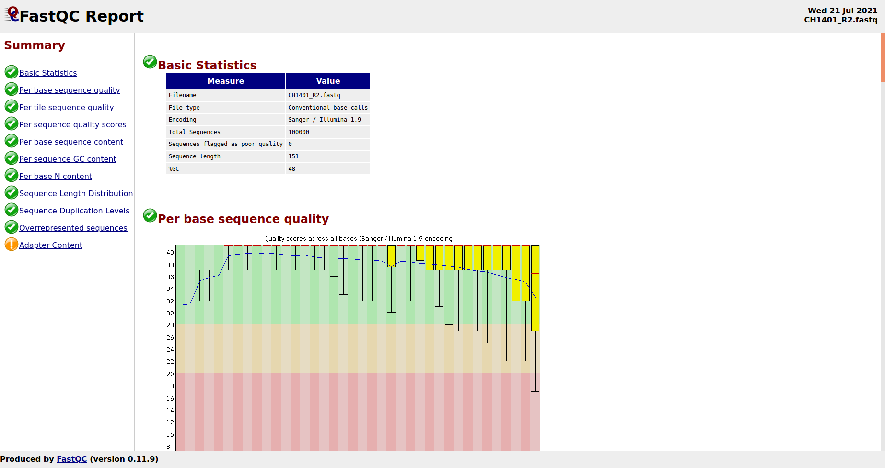
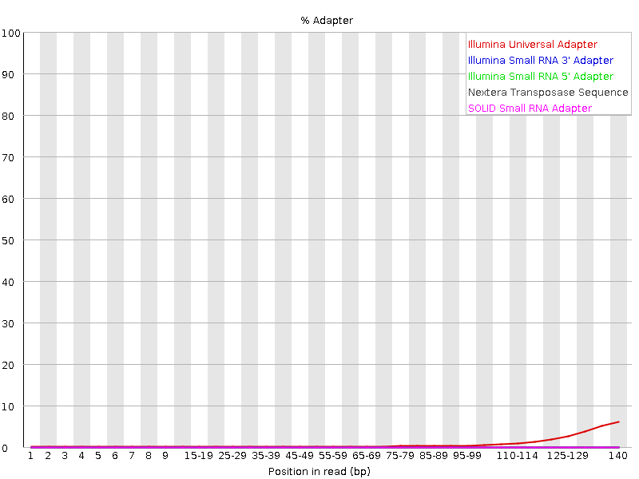
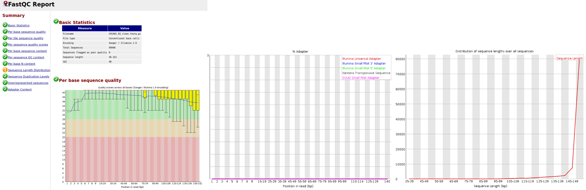
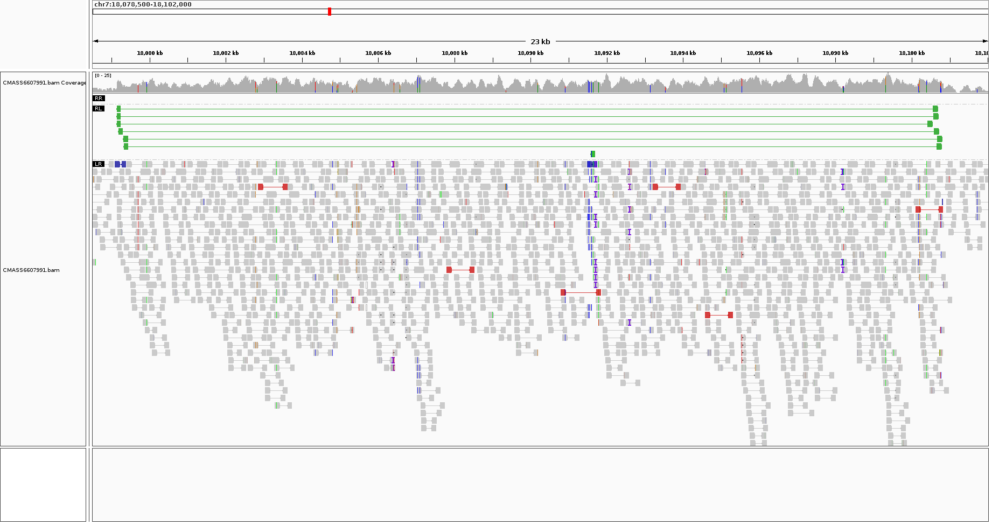
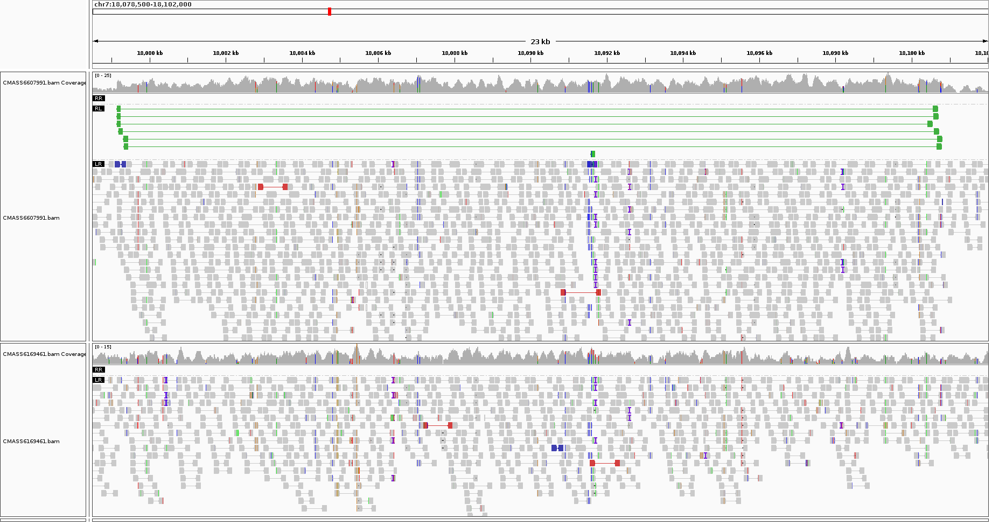
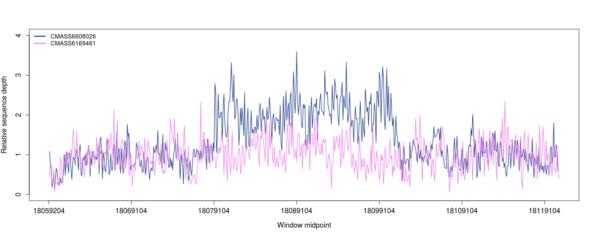
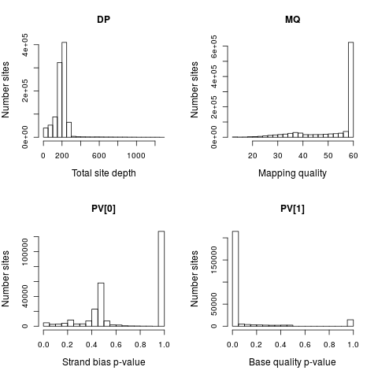
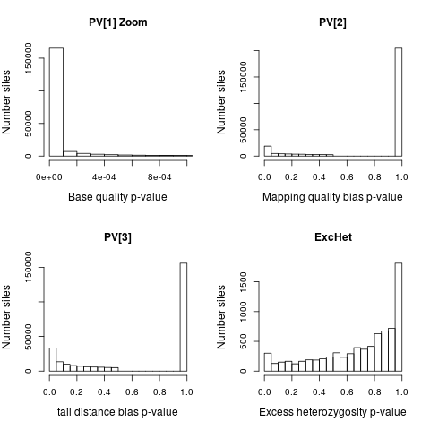
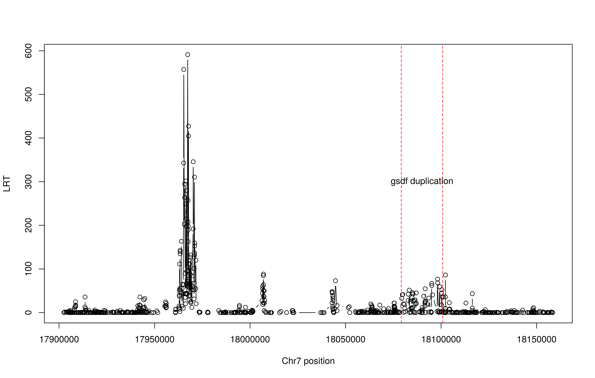

INTRODUCTION TO NGS DATA EXERCISES
==================================

For these exercises we will use exome capture data from the Peruvian mimic poison dart frog, *Ranitomeya imitator*, mapped to a *de novo* exome assembly.
The average sequencing depth of samples in this dataset is 14x.
<br>


<br>

We will also use whole genome sequencing data from the African cichlid fish *Astatotilapia calliptera* mapped to a chromosome-level *A. calliptera* assembly. 
These samples were sequenced to an average depth of 5.7x.

<br><br>


The goal of today is to learn how to prepare raw NGS data for downstream analyses. Specifically, you will
* Become familiar with FASTQ format
* Learn how to assess and control for data quality
* Map sequencing reads to a reference sequence
* Become familiar with SAM/BAM and pileup formats for mapped data
* Learn how to use IGV to interactively explore mapping information
* Generate sequencing depth profiles
* Become familiar with VCF format and BCFtools
* Perform site-level quality control

Set some environmental variables required for subsequent steps
	
	# set up directories
	mkdir ~/ngs_intro && mkdir ~/ngs_intro/output

	# set environment variables
	DIR=~/ngs_intro
	DATDIR=/ricco/data/tyler
	IGV=$DATDIR/prog/IGV_Linux_2.9.4/igv.sh
	BAMLIST=$DATDIR/cichlid_bams.list
	CICHREF=$DATDIR/ref/GCA_900246225.3_fAstCal1.2_genomic_chromnames_mt.fa
	BAMDIR=$DATDIR/bams
	SCRIPTS=$DATDIR/scripts
	BCFTOOLS=$DATDIR/prog/bin/bcftools
	ANGSD=/ricco/data/tyler/prog/bin/angsd

## fastq file format and quality

We will first work with the poison frog exome capture data. Note that everything you learn with these data are transferable to 
NGS data prepared using other short read sequencing approaches (e.g. WGS and RADseq). These frogs have massive genomes and so 
WGS was not a practical approach for population genetics.

Have a look inside one of the frog fastq files:

	less "$DATDIR/fastq/CH1401_R1.fastq"

Explore the data quality with [fastqc](https://www.bioinformatics.babraham.ac.uk/projects/fastqc/). You can get some help information with `fastqc --help`.
FastQC will automatically detect file format type, but you can also specify it with `-f`.

```bash	
fastqc -outdir "$DIR/output/" $DATDIR/fastq/*.fastq
```

List the files that were dumped.

```bash
ll "$DIR/output/"
```

You can scp the html files onto your local machine and view them in a browser. Here's an example of what the top of the web page would look like 
for the CH1401_R2.fastq file:



Perhaps we have some adapter contamination to worry about which you can examine in more detail over the browser interface. Note that
you can also view FastQC results outside of a browser like so:

```bash
# Let's examine the reverse read info for sample CH1401
unzip "$DIR/output/CH1401_R2_fastqc.zip" -d "$DIR/output/"
```
```bash
# Data summary
cat "$DIR/output/CH1401_R2_fastqc/summary.txt"
```
```bash
# Look at adapter contamination plot

# !!! This can take a while to load over a remote connection so you can either scp the 
# adapter_content.png file onto you local machine and look at it or reveal the image below.
eog "$DIR/output/CH1401_R2_fastqc/Images/adapter_content.png"
```

<details>

<summary> click here to view adapter_content.png image </summary>



</details>

Can you see what FastQC is picking up on? How is the contamination distributed along the reads?

## Clean fastq files

We'll see if we can clean up the adapter contamination and low quality at the ends of the reads using [cutadapt](https://cutadapt.readthedocs.io/en/stable/). Normally for paired-end
data you would run in paired-end mode so that read pairs are maintained. Single-end mode can be run on the forward and reverse reads separately if it's desirable to retain unpaired reads 
(if a mate fails QC). Cutadapt performs partial sums low-quality trimming. You can check out 
the [algorithm](https://cutadapt.readthedocs.io/en/stable/algorithms.html#quality-trimming-algorithm) to see how it works. We'll use a quality cutoff of `-q 15` and specify 
Illumina TruSeq [adapters](https://support.illumina.com/bulletins/2016/12/what-sequences-do-i-use-for-adapter-trimming.html), which is what were used for the frog sequencing.

```bash
# RUN THIS ONE (paired-end mode)
cutadapt -q 15 -a AGATCGGAAGAGCACACGTCTGAACTCCAGTCA -A AGATCGGAAGAGCGTCGTGTAGGGAAAGAGTGT --minimum-length 36 \
-o "$DIR/output/CH1401_R1_clean.fastq.gz" -p "$DIR/output/CH1401_R2_clean.fastq.gz" \
"$DATDIR/fastq/CH1401_R1.fastq" "$DATDIR/fastq/CH1401_R2.fastq"

# example of single-end mode below

#cutadapt -q 15 -a AGATCGGAAGAGCACACGTCTGAACTCCAGTCA --minimum-length 36 \ 
#-o "$DIR/output/CH1401_R1_clean_se.fastq.gz" "$DATDIR/fastq/CH1401_R1.fastq"

#cutadapt3 -q 15 -a AGATCGGAAGAGCGTCGTGTAGGGAAAGAGTGT --minimum-length 36 \ 
#-o "$DIR/output/CH1401_R2_clean.fastq.gz" "$DATDIR/fastq/CH1401_R2.fastq"
```

use FastQC to check what the data quality looks like for CH1401_R2.fasq after trimming

```bash
fastqc -outdir "$DIR/output/" "$DIR/output/CH1401_R2_clean.fastq.gz"
```

<details>

<summary> Check out how cutadapt cleaned up the data </summary>



<br>

Note that the warning for the read length distribution is not of concern in this case. 
It's only alerting you that there are some short reads now, which we expect based on how we trimmed. 
Now you should know how to check the read length distribution with FastQC. Give it a try if you want (you 
should see the plot on the far right above).

</details>

<br>

## Mapping

Use [bwa](https://github.com/lh3/bwa) to map the reads to the *R. imitator* exome assembly.

```bash
FROG_REF="$DATDIR/ref/imi_combined_targetedAndflanking_geneid.fasta"

# normally you'd have to index the reference assembly (this has already been done for you,
# so I've commented this step out).

# bwa index "$FROG_REF"
```
```bash
# Generate sorted bam
bwa mem -R '@RG\tID:CH1401_capture1\tSM:CH1401' "$FROG_REF" "$DIR/output/CH1401_R1_clean.fastq.gz" "$DIR/output/CH1401_R2_clean.fastq.gz" \
| samtools sort -O BAM > "$DIR/output/CH1401.bam"
# consider using bioanalyzer info to set bwa option -I (insert size distribution)
```
```bash
# index bam (this allows programs to rapidly access subsets of reads)
samtools index "$DIR/output/CH1401.bam"
```

## Working with mapped data

After you've mapped your cleaned fastq reads you can have a look at the mapping information in SAM/BAM/CRAM files with samtools.
You can include the header with `-h`. When viewing the file type `/\@RG` and press `enter` to skip down to the bottom of the header to check that the
read group information that we intended to add is indeed there. Note also that you should see 'RG:Z:CH1401_capture1' associated with all of the reads.

	samtools view -h "$DIR/output/CH1401.bam" | less -S

Mapping info for the first five reads should look like:

	K00188:273:HG3VVBBXX:5:1102:21227:5077	99	contig1_combined	425	60	151M	=	522	248	GCCTCGGAGATGTGATGAATGTAACAGGTGCAGAGATTATTTCCAGGCCATGTGTGTGCGTCTGTGTGTAACAGCAAGAGGGGGAGAGAGAATGCAGAAAAGGAGAGAGCACATTGATGTCCCTGCTACGTCTCTGTAGCCTGTGAAACTT	AAFFFJJJJJJJJJJJJJJJJJJJJJJJJJJJJJJJJJJJJJJJJJJJJJJJJJJJJJJJJJJJJJJJJJJJJJJJJJJJJJJJJJJJJJFFJJJJJJJJJJJJJJJJJJJJJJJJFJJJJJJJJJJJJJJJJJJJJJJJJJJJJJJJJJJ	NM:i:0	MD:Z:151	MC:Z:151M	AS:i:151	XS:i:0	RG:Z:CH1401_capture1
	K00188:273:HG3VVBBXX:5:1102:21227:5077	147	contig1_combined	522	60	151M	=	425	-248	AAAAGGAGAGAGCACATTGATGTCCCTGCTACGTCTCTGTAGCCTGTGAAACTTACAGCAGATTGCCTTCGAGCGACCTAAATACTAAAGAAAAAAAGAGAAGAAAGATCGGAGAAGAGAAGAGGGTGGACACATAAAGGGTTATTTGCAT	JAAJJJFJJJJJFJJFAFJJJJFFJJJJJJJJJJJJJJJJJJJJJJJJJJJJJJJJJJFJJJJJJJJJJJFJJJFJFJJJJJFJJJJJJJJJJJJJJJJJJJJJJJJJJJJJJJJJJJJFJJJJJJJJJJJJJJJJJJJJJJJJFJFFFAA	NM:i:0	MD:Z:151	MC:Z:151M	AS:i:151	XS:i:0	RG:Z:CH1401_capture1
	K00188:273:HG3VVBBXX:5:1101:22800:30556	163	contig1_combined	1850	60	151M	=	1879	180	TTTAATTTTTCAATCAGTCATGTGTAAATATGAATATAATTAAGATTACAATTTACATTTTCTTTCCACAGATCTAAACATTACTGCTGCTGTCCTGTCTCTTTTGAGTATAACTTTTATGGTAATGGGATCAATATGCATCACTATGGTT	AAFFFJJJJJJJJJJJJJJJJJJJJJJJJJJJJJJJJJJJJJJJJJJJJJJJJJJJJJJJJJJJJJJJJJJJJJJJJJJJJJJJJAFJFJJJJJJJJJJJJJJJJJJJJJJJJJJJJJJJJJJJJJJJFJJJAFJJJJJJJJJJJJJJJJJ	NM:i:5	MD:Z:0A4C4G20T8C110	MC:Z:151M	AS:i:130	XS:i:19	RG:Z:CH1401_capture1
	K00188:273:HG3VVBBXX:5:1101:22800:30556	83	contig1_combined	1879	60	151M	=	1850	-180	ATGAATATAATTAAGATTACAATTTACATTTTCTTTCCACAGATCTAAACATTACTGCTGCTGTCCTGTCTCTTTTGAGTATAACTTTTATGGTAATGGGATCAATATGCATCACTATGGTTCTCAGCAAAGGTGTGGAGTTCCTTCTGAA	JJJJJJJJJJJJJJJJJJJJJJJJJJJJJJJJJJJJJJJJJJJJJJJJJJJJJJJJJJJJJJJJJJJJJJJJJJJJJJJJJJJJJJJJJJJJJJJJJJJJJJJJJJJJJJJJJJJJJJJJJJJJJJJJJJJJJJJJJJJJJJJJJJFFFAA	NM:i:2	MD:Z:2T8C139	MC:Z:151M	AS:i:143	XS:i:0	RG:Z:CH1401_capture1
	K00188:273:HG3VVBBXX:5:1101:25621:48245	163	contig1_combined	2503	60	151M	=	2553	201	GGCTGGCTAATGGCAAGCAATCAGAACGTGAAGCTAGAATATGAGTATTCATGGTCCGTGGCCTGTGCGGCGGCAGCGGGAGGCGTCTTAATATTTGGTGGAATATGTTGCATTTTCTTGGTATTGCCGTCATTGCCCAAAAAGCCTTGGG	AAFFFJJJJJJJJJJJJJJJJJJJJJJJJJJJJJJJJJJJJJJJJAJFJJJJJJJJJJJJJJJJJJJJJJJJJJJJJJ<JJJJJJFJJJJJJJJJJJJJJJJJJJJJJJJJJJJJJJJJJAJJJJJJJFJJJJJJJJJJJJJJJJJJAJJJ	NM:i:0	MD:Z:151	MC:Z:151M	AS:i:151	XS:i:0	RG:Z:CH1401_capture1

A useful resource for interpreting the bitwise flags (second column) is [here](https://broadinstitute.github.io/picard/explain-flags.html). What do they tell you about the mapping
of these first five reads?

Now we are going to switch over to the cichlid WGS data and you'll see it's basically the same, but mapping to a more complete reference
will help us make some interesting inferences as you will see. Let's take a peak at one of the bams.

```bash
# note the header won't show up because we omit -h this time
samtools view "$BAMDIR/CMASS6169443.bam" | less -S
```

The first fives lines (`samtools view $DATDIR/bams/CMASS6169443.bam | head -n 5`) should look like

	HS30_18456:2:2102:20331:79677#7	99	chr7	73	57	125M	=	407	459	ACGAGCAAGAGGACAGTTTCAAAGCAGACATTATGGCACAATAAAAGCTGTGAGAGCAGAGATTCATTCATATCTTTACTATTTTTCTTTAGCTTCTACTCCCGCTGCTTACAATAAATCTGAGA	EEEEEEEEEEEEEEEEEEEEEEEEEEEEEEEEEEEEEEEEEEEEEEEEEEEEEEEEEEEEEEEEEEEEEEEEEEEEEEEEEEEEEEEEEEEEEEEEEEEEEEEEEEEEEEEEEEEEEEEEEEEEE	AS:i:125	XS:i:115	BC:Z:CAGATCTGTCTTTCCC	QT:Z:BBBBBFFF/BBBBFFF	MQ:i:40	MC:Z:125M	ms:i:4579	MD:Z:125	NM:i:0	RG:Z:18456_2#7
	HS30_18456:2:1213:20056:15084#7	163	chr7	75	0	125M	=	569	619	GAGCAAGAGGACAGTTTCAAAGCAGACATTATGGCACAATAAAAGCTGTAAGAGCAGAGATTCATTCATATCTTTACTATTTTTCTTTAGCTTCTACTCCCGCTGCTTACAATAAATCCGAGATA	DDDDDDDDDDDDDDD/AAAAAAAAAAAAAAAAAAAAAAAAAAAAAAAAAAAAAAAAAAAAAAA/AAAAAAAAAAAAAAAAAAAAAAAAAAAAAAAA/DDDDDD/DDDD/FF/B5555F/B555FF	AS:i:115	XS:i:125	XA:Z:chr8,-23982502,125M,0;chr16,-2795516,125M,1;chr18,+31933308,125M,1;chr18,+30035828,125M,2;chr8,-23993408,125M,3;	MQ:i:9	MC:Z:125M	ms:i:4159	MD:Z:49G68T6	NM:i:2	RG:Z:18456_2#7
	HS30_18456:2:2211:1719:11546#7	163	chr7	103	51	125M	=	391	413	TTATGGCACAATAAAAGCTGTGAGAGCAGAGATTCATTCATATCTTTACTATTTTTCTTTAGCTTCTACTCCCGCTGCTTACAATAAATCTGAGATAAAGAACAAACAAGAACAACTCACATGGC	EEEEEEEEEEEEEEEEEEEEEEEEEEEEEEEEEEEEEEEEEEEEEEEEEEEEEEEEEEEEEEEEEEEEEEEEEEEEEEEEEEEEEEEEEEEEEEEEEEEEEEEEEEEEEEEEEEEEEEEEEEEEE	AS:i:125	XS:i:115	MQ:i:40	MC:Z:125M	ms:i:4597	MD:Z:125	NM:i:0	RG:Z:18456_2#7
	HS30_18456:2:2101:10435:101060#7	99	chr7	118	0	125M	=	499	506	AGCTGTAAGAGCAGAGATTCATTCATATCTTTACTATTTTTCTTTAGCTTCTACTCCCGCTGCTTACAATAAATCCGAGATAAAGAACAAACAAGAACAACTCACATGGCATTGATTGTTTAGTT	>>>>>>>>>>>>>>>>>>>>>>>>>>>>>>>>>>>>>>>>>>>>>>>>>>>>>>>>>>>>>>>>>>>>>>>>>>>>>>>>>>>>>>>>>>>>>>>>>>>>>>>>>>>>>>>>>>>>>>>>>>>/F	AS:i:115	XS:i:125	XA:Z:chr8,-23982459,125M,0;chr18,+30035871,125M,0;chr16,-2795473,125M,1;chr18,+31933351,125M,1;U_scaffold_23,-9073,125M,2;	BC:Z:CAGATCTGTCTTTCCC	QT:Z:BBBBBFFF/7<BB/B/	MQ:i:8	MC:Z:125M	ms:i:4556	MD:Z:6G68T49	NM:i:2	RG:Z:18456_2#7
	HS30_18456:2:1316:11207:16667#7	163	chr7	126	0	125M	=	459	458	GAGCAGAGATTCATTCATATCTTTACTATTTTTCTTTAGCTTCTACTCCCGCTGCTTACAATAAATCCGAGATAAAGAACAAACAAGAACAACTCACATGGCATTGATTGTTTAGTTCAGTGTCA	DDDDDDDDDDDDDDDDDDDDDDDDDDDDDDDDDDDDDDDDDDDDDDDDDDDDDDDDDDDDDDDDDDDDDDDDDDDDDDDDDDDDDDDDDDDDDDDDDDDDDDDDDDDDDDDDDDDDDDDDDDDD/	AS:i:120	XS:i:125	MQ:i:6	MC:Z:125M	ms:i:4546	MD:Z:67T57	NM:i:1	RG:Z:18456_2#7

You can quickly view all reads that map to a specific region by specifying the region-of-interest. 
For example, to see all reads that map from positions 1000 to 1010 of chromosome 7 you would use

```bash
samtools view $DATDIR/bams/CMASS6169443.bam chr7:1000-1010 | less -S
``` 

## SAMtools mpileup

Lets looks at the mapped data on chr7:10000-10015 for all samples as a pileup

```bash
# check out the bam list
cat "$BAMLIST"
```
```bash
# Generate pileup info 
samtools mpileup -b $BAMLIST -f $CICHREF -r chr7:10000-10015 | less -S
```

Here's what the data looks like for the first 6 individuals in the bam file, `samtools mpileup -b $BAMLIST -f $CICHREF -r chr7:10000-10015 | cut -f1-21 | column -t`

	chr7  10000  T  2  .,      EB    7  .,,,,,^],   >IIBGGE   6  .....,       DEGEGG     9   ,.,,.,,.,     DABGIIIII   5  ,,.,.  >AB/A  6  .,,...  FGGBGB
	chr7  10001  C  3  .,^].   EBB   7  .,,,,,,     >IIBGGI   6  .....,       DEGEGG     9   ,.,,.,,.,     DABGIIIII   5  ,,.,.  >ABDA  6  .,,...  3GGBGB
	chr7  10002  G  3  .,.     EBB   7  .,,,,,,     >IIBGGI   6  .....,       DEGEGG     9   ,.,,.,,.,     DABGIIIII   5  ,,.,.  >ABDA  6  .,,...  3GGBGB
	chr7  10003  G  3  .,.     EBB   7  .,,,,,,     >IIBGGI   6  .....,       DEGEGG     10  ,.,,.,,.,^].  DABGIIIIIE  5  ,,.,.  >AB/A  6  .,,...  3GGBGB
	chr7  10004  A  3  .,.     EBB   8  .,,,,,,^].  >IIBGGIE  6  .....,       DEGEGG     10  ,.,,.,,.,.    DABGIIIIII  5  ,,.,.  >AB/A  6  .,,...  3GGBGB
	chr7  10005  G  3  .,.     EBB   8  .,,,,,,.    >IIBGGIG  6  .....,       DEGEGG     10  ,.,,.,,.,.    DABGIIIIII  5  ,,.,.  >ABDA  6  .,,...  BGGBGB
	chr7  10006  A  3  .,.     EBB   8  .,,,,,,.    >IIBGGIG  6  .....,       DEGEGG     10  ,.,,.,,.,.    DABGIIIIII  5  ,,.,.  >ABDA  6  C,,...  5G/BGB
	chr7  10007  G  3  .,.     EBB   8  .,,,,,,.    >IIBGGIG  7  .....,^].    DEGEGGE    10  ,.,,.,,.,.    DABGIIIIII  5  ,,.,.  >ABDA  6  .,,...  5GIBGB
	chr7  10008  C  3  .,.     EBB   8  .,,,,,,.    >IIBGGIG  7  .....,.      DEGEGGG    10  ,.,,.,,.,.    DABGIIIIII  5  ,,.,.  >ABDA  6  .,,...  5GIBGB
	chr7  10009  A  3  .,.     EBB   8  .,,,,,,.    >IIBGGIG  8  .....,.^],   DEGEGGGB   10  ,.,,.,,.,.    DABGIIIIII  5  ,,.,.  >ABDA  6  .,,...  5GIBGB
	chr7  10010  G  3  .,.     EBB   8  .,,,,,,.    >IIBGGIG  8  .....,.,     DEGEGGGB   10  ,.,,.,,.,.    DABGIIIIII  5  ,,.,.  >AB/A  6  .,,...  DGIBGB
	chr7  10011  C  3  .,.     EBB   8  .,,,,,,.    >IIBGGIG  8  .....,.,     DEGEGGGB   10  ,.,,.,,.,.    DABGIIIIII  5  ,,.,.  >ABAA  6  .,,...  DGIBGB
	chr7  10012  T  3  .,.     EBB   8  .,,,,,,.    >IIBGGIG  8  .....,.,     DEGEGGGB   10  ,.,,.,,.,.    DABGIIIIII  5  ,,.,.  >/BAA  6  .,,...  DGIBGB
	chr7  10013  T  3  .,.     EBB   8  .,,,,,,.    >IIBGGIG  9  .....,.,^],  DEGEGGGBE  10  ,.,,.,,.,.    DABGIIIIII  5  ,,.,.  >BBAA  6  .,,...  DGIBGB
	chr7  10014  A  4  .,.^].  EBBE  8  .,,,,,,.    >IIBGGIG  9  .G...gG,,    DEGEGGGBG  10  ,.,,.,,.,.    D3BGIIIIII  5  ,,.,C  >BBAA  6  .,,...  DGIBGB
	chr7  10015  G  4  .,..    EBBI  8  .,,,,,,.    >IIBGGIG  9  .....,.,,    DEGEGGGBG  10  ,.,,.,,.,.    D3BGIIIIII  5  ,,.,.  >BBAA  6  .,,...  /GIBGB

Looking at this data do you think you could confidently call genotypes?

Now figure out how to generate the same pileup but one that includes mapping quality and that only consider reads with a minimum quality/BAQ of 20.
Write the output to "${DIR}/output/mapq_example.pileup".  <br>

You can see help for samtools mpileup with 
```bash
samtools mpileup --help
```

<details>

<summary>Click here for code</summary>

``` bash
samtools mpileup -b $BAMLIST -f $CICHREF -r chr7:10000-10015 -Q 20 --output-MQ > $DIR/output/mapq_example.pileup
```

```bash
# Examine the file in an easy-to-read way (aligns the columns nicely)
cat $DIR/output/mapq_example.pileup | column -t | less -S
```

</details>

## IGV (Integrative Genomics Viewer)
Executing the commands in this section is optional because running a visualization program like IGV is painfully slow over
a remote connection, but I've included instructions on how to run it so that you can try it out later. I would encourage 
you to read this section still so that you familiarize yourself with what IGV can do.

The [Integrative Genomics Viewer](https://software.broadinstitute.org/software/igv/) (IGV) provies a useful way to visualize mapping information.

	# start up igv
	$IGV

	# SKIP THE FOLLOWING (it's already been done for you)
	
	# load reference genome
	# In the drop-down menu: 'Genomes' -> 'Load Genome from File...' and select /ricco/data/tyer/ref/GCA_900246225.3_fAstCal1.2_genomic_chromnames_mt.fa
	
	# load BAM
	# In top menu: 'File' -> 'Load from File...' select /ricco/data/tyler/bams/CMASS6607991.bam
	
	# START HERE
	# 1) In the drop-down menu 'File -> Open session... -> '+ Other locations/Computer/ricco/data/tyler/igv_sessions/CMASS6607991.xml' 
	# 2) In the box next to 'Go' type 'chr7:18,078,500-18,102,000' and press 'Go'
	# 3) Right-click on the track containing the reads in the IGV window and select 'view as pairs' and 'Group alignment by' -> 'pair orientation'
	# 4) click on one of the green reads and figure out where its mate maps. What orientation are these reads mapping in?
	# You can use the scroll bar along the top to explore more mapping along chr7.

<details>

<summary> Click here to see what you should be seeing </summary>



</details>

Now we'll compare mapping for the sample you just looked at to another one.<br>
Can you tell which one has improperly mapped reads?

<details>

<summary> Click here for image </summary>



</details>

Can you tell which one has improperly mapped reads?

<details>

<summary>Answer</summary>

CMASS6607991 (top): improper<br>
CMASS6169461 (bottom): proper

</details>

<br> <br>

## Sequencing depth plot

Let's check the depth spanning the region where reads were mapping in the RL orientation +/- ~20 kb. Do this for a subset of samples
showing different mapping patterns (4 strange, 2 normal).

``` bash
# improper mapping
BAM1=$BAMDIR/CMASS6608026.bam
BAM2=$BAMDIR/CMASS6607991.bam
BAM3=$BAMDIR/CMASS6389722.bam
BAM4=$BAMDIR/CMASS6169445.bam

# proper mapping
BAM5=$BAMDIR/CMASS6169461.bam
BAM6=$BAMDIR/CMASS6169443.bam

(( echo -e "CHR\tPOS\t$BAM1\t$BAM2\t$BAM3\t$BAM4\t$BAM5\t$BAM6" | sed "s;\($BAMDIR\/\|.bam\);;g" ); \
(samtools depth -a -r chr7:18059155-18120834 $BAM1 $BAM2 $BAM3 $BAM4 $BAM5 $BAM6)) > $DIR/output/cichlid_region_depth.txt
```

```bash
# Calculate depth relative to genome-wide average and plot a depth profile
# Note: calmas_meta_sub.txt file contains cichlid metadata including the average genome-wide sequence depth.

$SCRIPTS/plot_depth_region.R $DIR/output/cichlid_region_depth.txt $DATDIR/calmas_meta_sub.txt $DIR/output/region_depth_profile
```
<details>

<summary> Click here to see plot_depth_region.R code </summary>

```bash
#!/usr/bin/env Rscript

# plot_depth_region.R <depth file> <metadata file> <output prefix>

## parse input from the command line

args <- commandArgs(trailingOnly=TRUE)

depth <- read.table(args[1], head=TRUE)
meta <- read.table(args[2], head=TRUE)
outprefix <- args[3]

## normalize the depth of every sample by their genome-wide depth
for (i in 3:ncol(depth)) { depth[,i] = depth[,i]/meta$sequence.depth[which(meta$sample.ID == colnames(depth)[i])]}

# print relative depth of samples for the region spanning improperly mapped reads
start = 18079155 # start of region where reads map in RL orientation
end = 18100834 # end of region where reads map in RL orientation
cat("\nRelative sequencing depth\n\n")
for (i in 3:ncol(depth)) { cat(paste0(colnames(depth)[i],": ", round(mean(depth[,i][which(depth$POS > start & depth$POS < end)]),digits=3),"\n")) }

## take mean in 100 bp windows for smoothing (makes viewing the plots easier) ##
inc=100
win=matrix(nrow=ceiling(nrow(depth)/inc), ncol=ncol(depth))
a=1
b=inc
for (i in 1:nrow(win)) {
        win[i,1] = depth$POS[a]
        win[i,2] = depth$POS[b]
        for (j in 3:ncol(depth)) { win[i,j] = mean(depth[a:b,j])}
        a=b+1
        b=a+inc-1
        if (b > nrow(depth)) b = nrow(depth)
}

# plot relative coverage profile for 2 of the individuals

n=nrow(win)
mid = round((win[,1]+win[,2])/2)
pdf(file=paste0(outprefix,".pdf"),width=8,height=5)
plot(x=1:n, y=win[,3],type="l", ylim=c(0,4), col="royalblue4", xlab="Window midpoint", ylab="Relative sequence depth", cex.axis=1.2, cex.lab=1.2, lwd=1.5, xaxt='n')
axis(1, at=c(0,100,200,300,400,500,600),labels=mid[c(1,100,200,300,400,500,600)],cex.axis=1.2)
lines(x=1:n, y=win[,7], col="violet", lwd=1.5)
legend("topleft", c("CMASS6608026","CMASS6169461"),col=c("royalblue4","violet"), lwd=3, bty='n')
invisible(dev.off())
```

</details>

Lets look at the depth plot

```bash
evince "$DIR/output/region_depth_profile.pdf"
```
<details>

<summary> click here to view the depth plot </summary>



</details>

What can you infer about the genomes of these six cichlid samples from the mapping information
that you've seen in IGV and depth profiling?

<details>

<summary> Click here for answer </summary>

There is a tandem duplication on chromosome 7 spanning positions 18,079,155-18,100,834. This duplication encompasses the *gonadal soma-derived factor*, *gsdf*, gene. 
The duplication allele operates as a sex determiner by masculinizing its bearers. <br>

~1x relative depth = Homozygous for the non-duplicated *gsdf* allele (2 *gsdf* copies)<br>
~1.5x relative depth = Heterozygous for the duplication allele (3 *gsdf* copies)<br>
~2x = Homozygous for the duplication allele (4 *gsdf* copies)

</details>

<br>

## bcftools filtering

Generate a VCF with some info that we can base quality control on. We'll use the first 1 MB of chr7 for this example.

```bash
$BCFTOOLS mpileup -f $CICHREF -b $BAMLIST \
-d 40000 -L 40000 -r chr7:1-1000000 -q 13 -Q 13 --ff UNMAP,SECONDARY,QCFAIL,DUP -a FORMAT/AD,FORMAT/DP,QS,FORMAT/SCR,INFO/AD,INFO/SCR -p O u \
| $BCFTOOLS call --ploidy 2 -a PV4,GQ,GP -m -P 0.001 -O u | $BCFTOOLS +fill-tags -O b -o $DIR/output/calmas_allsites.bcf.gz -- -t'AF,NS,ExcHet'
```

```bash
# Index the bcf for rapid access to specific regions with 'bcftools view -r ...'
bcftools index $DIR/output/calmas_allsites.bcf.gz
```
The vcf is in compressed binary fomat to save space so we'll have to use bcftools to view it. Let's have a look at the annotations that we
can use to filter on.

	$BCFTOOLS view $DIR/output/calmas_allsites.bcf.gz | less -S

Lets see how we can extract some information for quantities we might want to examine the distribution of prior to filtering. 
The various VCF statistics are defined in the VCF header. Check that out with `bcftools view -h $DIR/output/calmas_allsites.bcf.gz`.

``` bash
((echo -e "CHROM\tPOS\tDP\tMQ\tSTRAND_BIAS\tBASEQ_BIAS\tMQ_BIAS\tPOS_BIAS\tEXCHET"); \
($BCFTOOLS query -f "%CHROM\t%POS\t%INFO/DP\t%INFO/MQ\t%INFO/PV4{0}\t%INFO/PV4{1}\t%INFO/PV4{2}\t%INFO/PV4{3}\t%ExcHet\n" $DIR/output/calmas_allsites.bcf.gz)) > $DIR/output/allsites_stats.txt
```
```bash
# Have a look ('.' indicates that the value is missing)
less $DIR/output/allsites_stats.txt
```

Let's plot these values and examine percentiles to get an idea of extreme values may be
```bash
$SCRIPTS/plotStatDist.R $DIR/output/allsites_stats.txt $DIR/output/allsites_stats_plot
```

```bash
evince $DIR/output/allsites_stats_plot.pdf
```

<details>

<summary> click here to see quality statistic percentiles and plots </summary>

        Percentiles

                            0.1%           1%          10%          20%          30%
        DP          1.000000e+00 1.200000e+01 1.060000e+02 1.570000e+02 1.780000e+02
        MQ          1.300000e+01 2.200000e+01 3.500000e+01 4.300000e+01 5.400000e+01
        STRAND_BIAS 4.761011e-07 1.219852e-02 3.061478e-01 4.393060e-01 4.701490e-01
        BASEQ_BIAS  5.224217e-31 6.404809e-21 1.103558e-12 3.795092e-10 1.480062e-08
        MQ_BIAS     0.000000e+00 2.802600e-45 1.185121e-01 1.000000e+00 1.000000e+00
        POS_BIAS    1.145862e-04 2.673683e-03 3.093082e-02 1.212964e-01 2.907322e-01
        EXCHET      1.022730e-11 5.025090e-06 2.091916e-01 4.348290e-01 5.858350e-01
                            40%         50%          60%         70%          80%
        DP          1.90000e+02 2.00000e+02 2.090000e+02 2.19000e+02 2.300000e+02
        MQ          5.90000e+01 6.00000e+01 6.000000e+01 6.00000e+01 6.000000e+01
        STRAND_BIAS 4.91736e-01 7.68149e-01 1.000000e+00 1.00000e+00 1.000000e+00
        BASEQ_BIAS  2.56738e-07 2.99443e-06 3.206144e-05 3.75725e-04 9.199838e-03
        MQ_BIAS     1.00000e+00 1.00000e+00 1.000000e+00 1.00000e+00 1.000000e+00
        POS_BIAS    1.00000e+00 1.00000e+00 1.000000e+00 1.00000e+00 1.000000e+00
        EXCHET      7.00602e-01 7.97872e-01 8.622170e-01 9.16105e-01 9.589040e-01
                           90% 99%   99.9%
        DP          246.000000 461 954.804
        MQ           60.000000  60  60.000
        STRAND_BIAS   1.000000   1   1.000
        BASEQ_BIAS    0.254081   1   1.000
        MQ_BIAS       1.000000   1   1.000
        POS_BIAS      1.000000   1   1.000
        EXCHET        0.987342   1   1.000


<br>


</details>

<details>

<summary> Click here for the plotStatDist.R code </summary>

```bash
#!/usr/bin/env Rscript

# plotStatDist.R <file of vcf stats> <outfile prefix>

# parse arguments
args <- commandArgs(trailingOnly=TRUE)
df <- read.table(args[1],head=TRUE, na.strings=".")
suppressWarnings(df$EXCHET <- as.numeric(as.character(df$EXCHET))) # need this because R interprets this as a 'factor' due to many 'NA' at beginning
outprefix <- args[2]

# calculate percentiles
percdf=matrix(nrow=ncol(df)-2, ncol=13)
i=1
for (j in 3:ncol(df)) { percdf[i,] = quantile(df[,j], c(0.001, 0.01, seq(from=0.1, to=0.9, by=0.1), 0.99, 0.999), na.rm=TRUE); i=i+1 }
colnames(percdf) = names(quantile(df$DP, c(0.001, 0.01, seq(from=0.1, to=0.9, by=0.1), 0.99, 0.999), na.rm=TRUE))
rownames(percdf) = colnames(df[3:ncol(df)])

# print quantiles
cat("\n\nPercentiles\n\n")
print(percdf); cat("\n")

# plot stats
pdf(file=paste0(outprefix,".pdf"))
par(mfrow=c(2,2))
hist(df$DP, breaks=20, ylab="Number sites", xlab="Total site depth", main="DP", cex.lab=1.2)
hist(df$MQ, breaks=20, ylab="Number sites", xlab="Mapping quality", main="MQ", cex.lab=1.2)
hist(df$STRAND_BIAS, breaks=20, ylab="Number sites", xlab="Strand bias p-value", main="PV[0]", cex.lab=1.2)
hist(df$BASEQ_BIAS, breaks=20, ylab="Number sites", xlab="Base quality p-value", main="PV[1]", cex.lab=1.2)
hist(df$BASEQ_BIAS, breaks=10000, ylab="Number sites", xlab="Base quality p-value", main="PV[1] Zoom", cex.lab=1.2, xlim=c(0,0.001))
hist(df$MQ_BIAS, breaks=20, ylab="Number sites", xlab="Mapping quality bias p-value", main="PV[2]", cex.lab=1.2)
hist(df$POS_BIAS, breaks=20, ylab="Number sites", xlab="tail distance bias p-value", main="PV[3]", cex.lab=1.2)
hist(df$EXCHET, breaks=20, ylab="Number sites", xlab="Excess heterozygosity p-value", main="ExcHet", cex.lab=1.2)
invisible(dev.off())
```

</details>
<br>

Filter the VCF. We'll extract a list of sites that pass quality control cutoffs.
We can use these sites with ANGSD tomorrow for downstream inferences.

```bash
$BCFTOOLS norm -f $CICHREF -m +any $DIR/output/calmas_allsites.bcf.gz \
| $BCFTOOLS view -i 'N_PASS(FMT/DP[0-14] > 2) > 5 && N_PASS(FMT/DP[15-39] > 2) > 5' $DIR/output/calmas_allsites.bcf.gz \
| $BCFTOOLS view -e 'INDEL=1 || INFO/MQ < 25 || INFO/DP > 700 || INFO/PV4[0] < 1.2e-02 || INFO/PV4[1] < 6.4e-21 || INFO/PV4[2] < 2.8e-45 || INFO/PV4[3] < 2.7e-3 || INFO/ExcHet < 5e-06' -M 2 \
| $BCFTOOLS query -f "%CHROM\t%POS\n" > $DIR/output/qc_sites.pos
```

Can you describe what each of the filters is doing?

Lets have a look at our list of quality-controlled sites
```bash
less $DIR/output/qc_sites.pos
```

If we want to use these sites in ANGSD (tomorrow), we need to index them
```bash
$ANGSD sites index $DIR/output/qc_sites.pos
```

What pecentage of sites was removed (discounting those with entirely missing data)?

<details>

<summary> Click here for help </summary>

```bash
$BCFTOOLS query -f "%POS\n" $DIR/output/calmas_allsites.bcf.gz | wc -l
# 995197 sites had some data initially

wc -l $DIR/output/qc_sites.pos
# 900037 sites passed quality-control
```

We removed 95160 sites, which represents ~10% of the sites with data. This seems reasonable (~10-20% is pretty normal).

</details>

## Bonus exercise: detecting mapping problems in low depth data
Identifying genomic regions refractory to short read mapping can be more difficult to identify from the 
types of depth profiles that we examined earlier in low depth situations. It is also ineffective to 
detect these regions through excess heterozygosity from called genotypes due to the genotyping uncertainty.

Here we'll use [ngsParalog](https://github.com/tplinderoth/ngsParalog) to detect regions of confounded mapping
(which could be due to things like duplications), which is effective even in low-depth scenarios when there is 
population-level data. It is also useful for finding misassmbled or collapsed regions in reference genomes.

Non-variable sites are not informative for ngsParalog, so we'll generate a list of unfiltered SNPs in a 256 kb region
around the *gsdf* duplication that we can analyze.
```bash
bcftools query -f '%CHROM\t%POS\n' -i 'TYPE="snp" & ALT !~ ","' -r chr7:17902540-18158460 $DATDIR/vcf/calmas_allsites_17000000_19000000.bcf.gz > $DIR/output/calmas_raw_17902540_18158460_snps.pos
```

Now pass mpileup input for all 40 cichlid samples to ngsParalog.
```bash
$ samtools mpileup -b $BAMLIST -A -d 10000 -q 0 -Q 0 --ff UNMAP,DUP -l $DIR/output/calmas_raw_17902540_18158460_snps.pos -r chr7:17902540-18158460 | \
$DATDIR/prog/ngsParalog/ngsParalog calcLR -infile - > $DIR/output/bad_map_lr.txt
```
<details>
<summary>View the output</summary>

The first 10 lines of output, `$DIR/output/bad_map_lr.txt`, look like
```bash
chr7            	17902546    	65.82998510	65.82998510	0.00000000
chr7            	17902969    	90.19783220	89.49558313	1.40449814
chr7            	17903736    	117.07359342	116.38463971	1.37790742
chr7            	17904129    	102.99866257	102.13857697	1.72017121
chr7            	17904255    	68.25160703	67.99860716	0.50599975
chr7            	17904712    	71.97002494	71.67183068	0.59638851
chr7            	17905017    	13.80116391	12.75496570	2.09239643
chr7            	17905120    	52.10334983	50.81775994	2.57117978
chr7            	17905234    	7.34078068	7.34078068	0.00000000
chr7            	17905242    	88.54324830	87.24670809	2.59308043
```
The first two columns specify the site and the 5th column is the LRT statistic for whether reads from multiple 
loci map to a given site. This statistic is distributed according to a 50/50 mixture of a chi-square with 0 and 1 
degrees of freedom.

Plot LRT statistic

```bash
$DATDIR/scripts/plot_duplr.R $DIR/output/bad_map_lr.txt ngsParalog_LR_plot
```



The tandem *gsdf* duplication is clearly visible as well as some other regions with confounded 
mapping (LRT statistic peaks). You can confirm that the data at these sites looks unusual with mpileup for example.

</details>

<details>

<summary>Code to make ngsParalog plot</summary>

```bash
#!/usr/bin/env Rscript

args <- commandArgs(trailingOnly=TRUE)

dat <- read.table(args[1], head=FALSE)
outprefix <- args[2]
gsdf.cord <- c(18079155,18100834)

pdf(file=paste0(outprefix,".pdf"))

plot(x=dat$V2,y=dat$V5,type="b",xlab="Chr7 position", ylab="LRT", main="")
abline(v=gsdf.cord[1], col="red", lty=2)
abline(v=gsdf.cord[2], col="red", lty=2)
text(x=18111000, y=300, "gsdf duplication")

invisible(dev.off())
```
</details>
